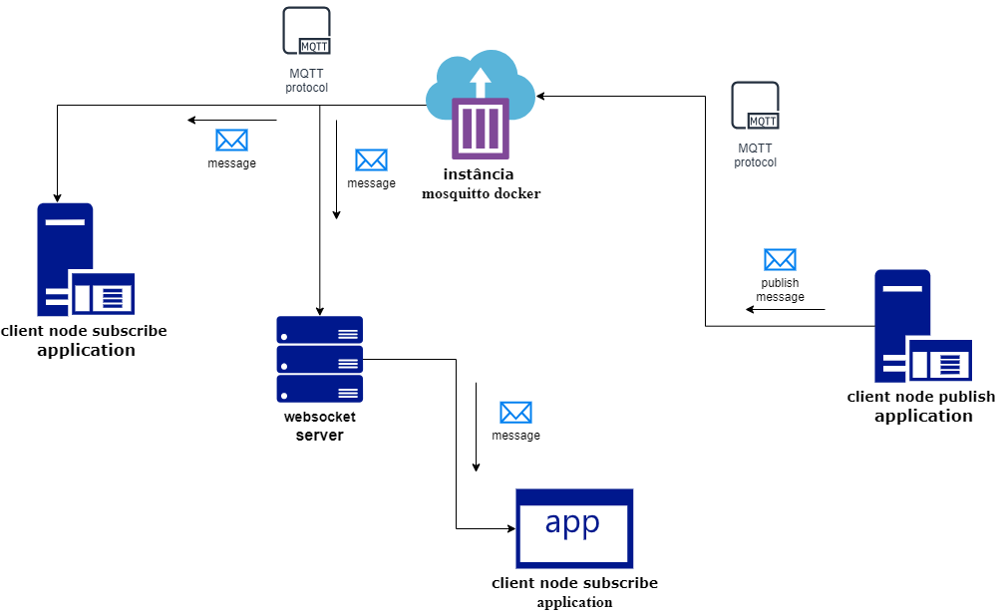

# Interface Consumo Protocolo MQTT
Interface Web para exibição de dados do broker MQTT mosquitto 

## Required softwares
- [**docker**](https://www.docker.com/)
- [**node**](https://nodejs.org/pt)
 
## Sobre o Next.js

This is a [Next.js](https://nextjs.org) project bootstrapped with [`create-next-app`](https://nextjs.org/docs/app/api-reference/cli/create-next-app).

## Learn More

To learn more about Next.js, take a look at the following resources:

- [Next.js Documentation](https://nextjs.org/docs) - learn about Next.js features and API.
- [Learn Next.js](https://nextjs.org/learn) - an interactive Next.js tutorial.

You can check out [the Next.js GitHub repository](https://github.com/vercel/next.js) - your feedback and contributions are welcome!

## Infrastructure


## Server Mosquitto

Para consumir dados será necessário já haver um servidor no [mosquitto](https://mosquitto.org/) já configurado e com a comunicação websocket já habilitada.

Neste demo vamos utilizar um container mosquitto no [docker](https://www.docker.com/).

Crie um arquivo Dockerfile na raiz do projeto, com as seguintes especificações:

```docker
FROM eclipse-mosquitto

COPY mosquitto.conf /mosquitto/config/mosquitto.conf

CMD ["mosquitto", "-c", "/mosquitto/config/mosquitto.conf"]
```

Crie um arquivo mosquitto.conf na raiz do projeto, com as seguintes especificações:

```conf
listener 1883
listener 9001
protocol websockets
allow_anonymous true
```
***Atenção:*** Ao definir `allow_anonymous true`, é uma opção altamente insegura, em ambiente de produção, habilite mecanismos de autenticação.

Execute o seguinte comando no terminal, no mesmo diretório do arquivo Dockerfile e mosquitto.conf, para criar a imagem do servidor mosquito no docker

```bash
docker build -t mosquitto-websocket .
```

Em seguida, execute o seguinte comando de criação do servidor mosquitto em um container docker:

```bash
docker run --name mosquitto_server -p 1883:1883 -p 9001:9001 mosquitto-websocket
```

## Get started In Client Server

Clone o projeto 
```bash
  git clone https://github.com/alimadeoliveiranatalia/real-time-use-mqtt.git
```
Entre no diretório backend e frontend
```bash
    cd backend
    # or
    cd frontend
```
Instale as dependências do projeto
```bash
    npm install
```
Abra o terminal e execute
```bash
    node client_subscribe.js
```
O console exibirá a seguinte messagem: Inscrito no tópico: <name_topico>

Em outro terminal execute
```bash
    node client_publish.js
```
O console irá exibir os dados do csv no console.

## Additional References

- [How to Configure Mosquitto MQTT Broker in Docker](https://cedalo.com/blog/mosquitto-docker-configuration-ultimate-guide/)
- [How to Configure MQTT over Websockets with Mosquitto Broker](https://cedalo.com/blog/enabling-websockets-over-mqtt-with-mosquitto/)